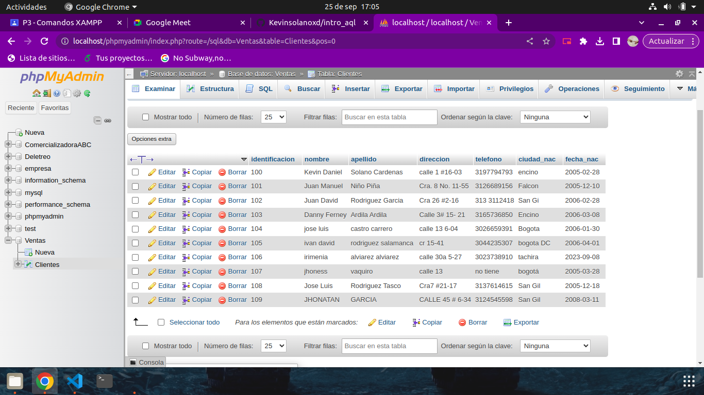

# INTRODUCCIÓN A SQLtos

1. Creación de unabase de datos (BD) con MySQL usando phpMyAdmin

## Creación tabla de cliente
### Diccionario de datos

|campo|tipo de dato|Longitud|
|-----|------------|--------|
|***indentificación***|varchar|15|
|nommbre|varchar|20|
|apellidos|varchar|20|
|direccion|varchar|25|
|telefono|varchar|20|
|ciudad_nac|varchar|20|
|fecha_nac|date||

### COdigo Diccionario de datos
CREATE TABLE `Ventas`.`Clientes` (`identificacion` VARCHAR NOT NULL , `nombre` VARCHAR NOT NULL , `apellido` VARCHAR NOT NULL , `direccion` VARCHAR NOT NULL , `telefono` VARCHAR NOT NULL , `ciudad_nac` VARCHAR NOT NULL , `fecha_nac` DATE NOT NULL , PRIMARY KEY (`identificacion`)) ENGINE = InnoDB

### Registro Cliente

#### Codigo Registro Un Cliente
INSERT INTO `Clientes` (`identificacion`, `nombre`, `apellido`, `direccion`, `telefono`, `ciudad_nac`, `fecha_nac`) VALUES ('100', 'Kevin Daniel', 'Solano Cardenas', 'calle 1 #16-03', '3197794793', 'encino', '2005-02-28');
### Tabla de registro de los clientes

